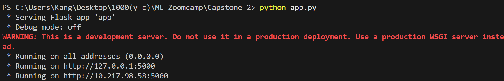
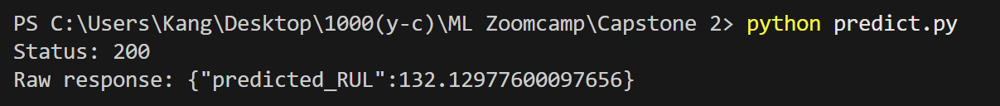
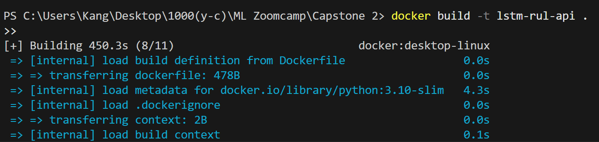
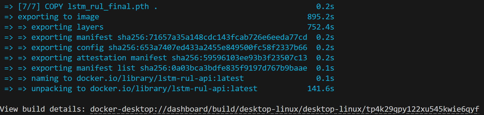
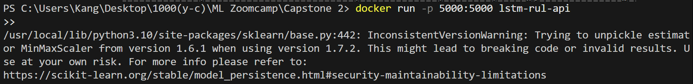
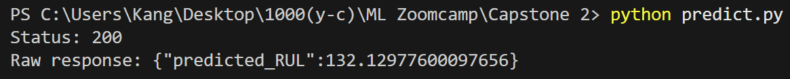

# Remaining Useful Life (RUL) Prediction of Aircraft Engines using LSTM

## 1. Problem Description

Predicting the **Remaining Useful Life (RUL)** of aircraft engines is critical in manufacturing and aviation maintenance. Accurate RUL prediction allows for **preventive maintenance**, reduces **unplanned downtime**, and improves **safety**.

This project uses sensor data from engines to predict the number of operational cycles left before failure using **deep learning (LSTM)**. The final solution is deployed as a **Flask API**, which can receive engine sensor data and return the predicted RUL.

---

## 2. Dataset

**NASA CMAPSS FD001 dataset**:  

- Source: [NASA CMAPSS Prognostics Dataset](https://ti.arc.nasa.gov/tech/dash/pcoe/prognostic-data-repository/)  
- Dataset contains **multivariate time series** from 100 engines.  
- Each engine has cycles of operation until failure.  
- Each cycle has:
  - 3 operational settings
  - 21 sensor measurements
- Preprocessing and feature selection:
  - Removed low-variance sensors
  - Selected 16 features: **cycle + 15 relevant sensors**
  - Normalized features with **MinMaxScaler** (fit on training data)

| Data Split | Engines | Cycles |
|------------|--------|--------|
| Training   | 100    | 20631  |
| Test       | 100    | 20631  |

---

## 3. Exploratory Data Analysis (EDA)

- **Cycle distribution**: Engines have 128–362 cycles before failure.
- **Sensor correlations with RUL**:
  - Top correlated: `sensor_11` (-0.70), `sensor_4` (-0.68), `sensor_15` (-0.64)
  - Low-variance sensors removed (`sensor_1`, `sensor_5`, `sensor_10`, `sensor_16`, `sensor_18`, `sensor_19`)
- **Operational settings** had very low variance; not used in the final model.
- **Scaling**: All input features were normalized with `MinMaxScaler`.

---

## 4. Models Tried

Multiple models were trained and evaluated:

| Model          | RMSE   | MAE   |
|----------------|--------|-------|
| Random Forest  | 31.47  | 23.92 |
| XGBoost        | 32.07  | 24.24 |
| MLP            | 30.02  | 23.65 |
| **LSTM (final)** | **25.57**  | **19.10** |

- **Final model**: LSTM with 128 hidden units, 2 layers, dropout 0.0, trained on sequences of 30 timesteps.
- Hyperparameters tuned using validation set to minimize RMSE.

---

## 5. Feature Engineering

1. Removed low-variance sensors.
2. Selected sensors most correlated with RUL.
3. Created sequences of **30 cycles** per engine for LSTM input.
4. Normalized features with `MinMaxScaler`.
5. Dataset ready shape: `(num_sequences, sequence_length=30, num_features=16)`

---

## 6. Model Deployment

- Flask API (`app.py`) exposes:

### 6.1 `/`  
- GET  
- Returns a simple status message: `"✅ LSTM RUL API is running!"`

### 6.2 `/predict`  
- POST  
- Input JSON:
```json
{
  "sequence": [
    [cycle, sensor_2, sensor_3, ..., sensor_21],
    ...
  ]
}
```

- Sequence must have 16 features per timestep, repeated for 30 timesteps.

- Returns:
```json
    {"predicted_RUL": float}
```

### 6.3 /docs

- GET

- Returns a simple HTML page with API usage instructions.

---

## 7. How to Run Locally

1. Install dependencies:

```bash
pip install -r requirements.txt
```

2. Run Flask server:

```bash
python app.py
```
The local API should be running like this:



3. Test prediction using predict.py:

```bash
python predict.py
```

Expected output (Make sure local API is running, run this in a separate terminal):



---

## 8. Docker Deployment

1. Build Docker image:
```bash
docker build -t lstm-rul-api .
```

You should see something like this when you start building Docker image:



This is how it looks when the Docker image is done building:


2. Run Docker container:
```bash
docker run -p 5000:5000 lstm-rul-api
```

You can refer to here:


3. Test using predict.py or any HTTP client.

Expected output (Make sure Docker container is running, run this in a separate terminal):



---

## 9. Project Structure
```text
Capstone-Project/
├── app.py                # Flask API
├── Dockerfile            # Container 
├── lstm_rul_final.pth    # Saved LSTM model
├── notebook.ipynb        # Notebook
├── predict.py            # Script to test API
├── README.md             # Description
├── requirements.txt      # Dependencies
├── RUL_FD001.txt         # Raw data(RUL only)
├── scaler.pkl            # MinMaxScaler used
├── screenshots           # Folder for photos
├── test_FD001.txt        # Raw data(test)
└── train_FD001.txt       # Raw data(train)
```

---

## 10. System Architecture

---

## 11. References
NASA CMAPSS Dataset: (https://data.nasa.gov/dataset/cmapss-jet-engine-simulated-data)